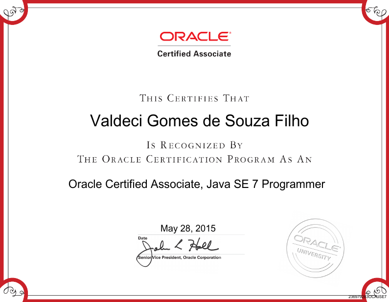
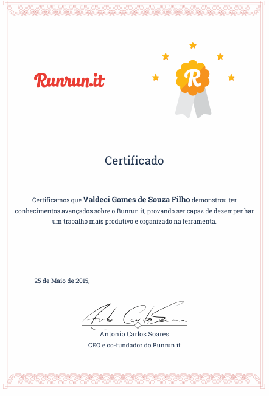
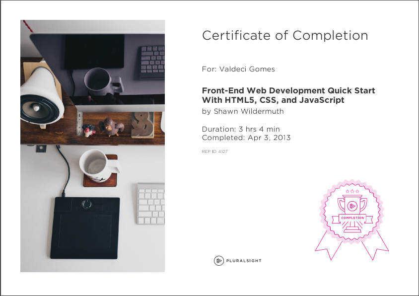
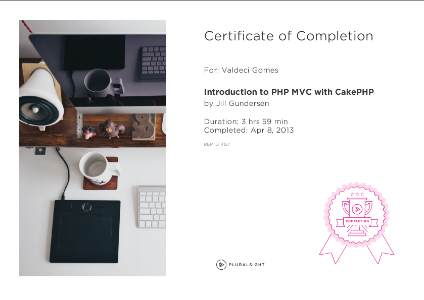
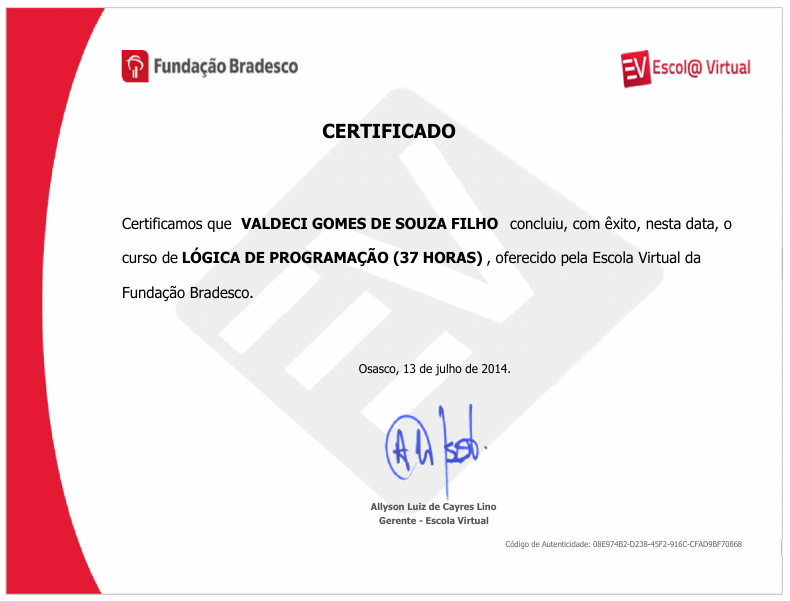
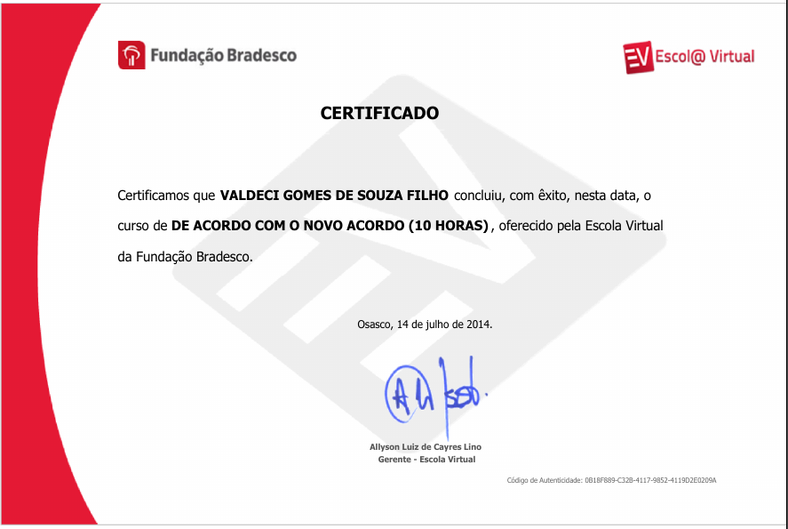
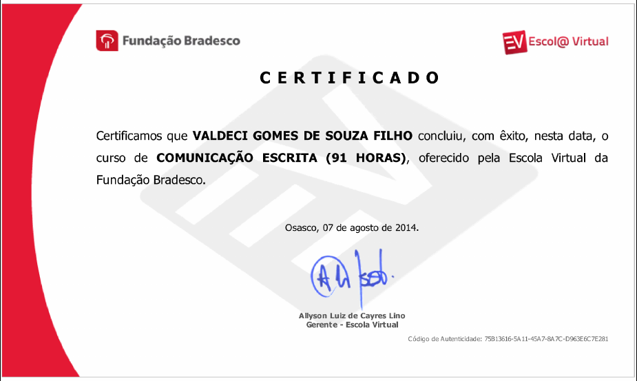
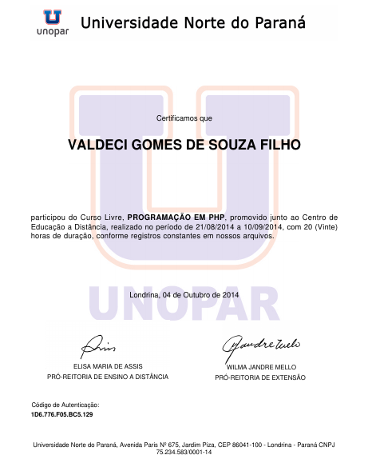
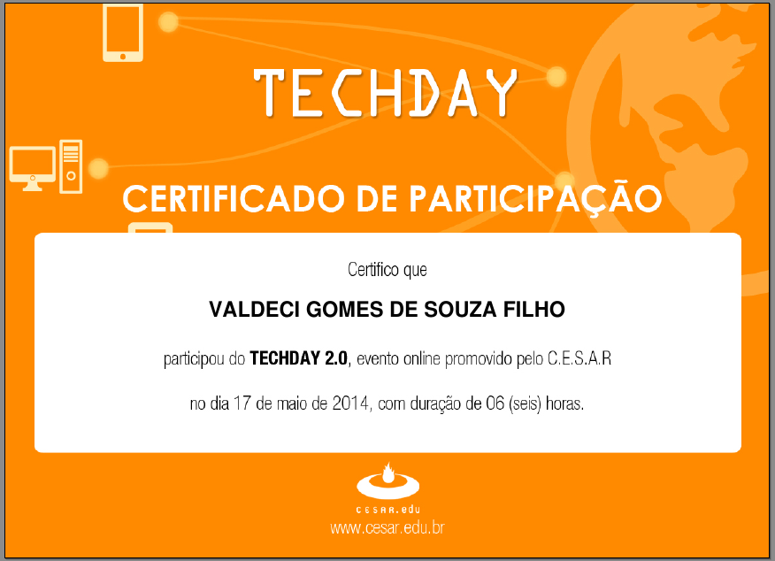

# Certificates
Repository that contain some of my certifications, courses and events certificates.
The certificates are sorted by the date that I got the certificates.

#####  Quick links
* [Certifications](#certifications)
* [Courses certificates](#courses-certificates)
* [Events certificates](#events-certificates) 

## Certifications

###  **May 2015**

#### - Oracle Certified Associate, Java SE 7 Programmer

A Java SE 7 Oracle Certified Associate (OCA) has built a foundational understanding of Java, while acquiring knowledge of general programming.

Certification URL: https://education.oracle.com/pls/web_prod-plq-dad/db_pages.getpage?page_id=5001&get_params=p_exam_id:1Z0-803

Applier: [Oracle University](http://education.oracle.com)

Language: EN-US

Claim: https://www.youracclaim.com/badges/683c766e-2b75-4d06-8d87-b638339efc37

#### - Expert User, RunRun.it
A universal test that validates if the user has advanced knowledge with the RunRun.it tool, testing the knowledge acquired at all levels of a RunRun.it user.

Certification URL: http://landing.runrun.it/certificacao-runrun-2/

Language: PT-BR

Applier: [RunRun.it](https://runrun.it/en-US)

## Courses certificates

###  February 2013

#### - Front-End Web Development Quick Start With HTML5, CSS, and JavaScript

For the beginner, starting to learn web development can be daunting. In this course, Shawn Wildermuth shows you step-by-step how to use client-side web development techniques to create immersive web sites.

Course URL: https://www.pluralsight.com/courses/front-end-web-app-html5-javascript-css

Language: EN-US

Applier: [Pluralsight](https://www.pluralsight.com/)

###  April 2013

#### - Introduction to PHP MVC with CakePHP

An introduction to building a PHP MVC website using the CakePHP Framework. The course includes installing and setting up your environment and walks you through the process of creating a functional web application.

Course URL: https://www.pluralsight.com/courses/introduction-php-mvc-cakephp

Language: EN-US

Applier: [Pluralsight](https://www.pluralsight.com/)

###  April 2014

#### - Windows 8.1 apps development with HTML5 and JavaScript

This series of videos presents the essential concepts involved in developing Windows 8.1 apps with HTML5 and JavaScript. The focus of the course is to explain the main functions and objects of the WinJS library, such as structuring code in namespaces and classes, declaration of WinJS controls and navigation, among others.

Course URL: https://mva.microsoft.com/pt-br/training-courses/desenvolvimento-de-apps-windows-81-com-html5-e-javascript-introduo-8843

Language: PT-BR

Applier: [Microsoft Virtual Academy](https://mva.microsoft.com/)

###  May 2014

#### - Storage Fundamentals 

Intel is at the forefront of providing technology that is being used to enable the deployment of scale-up and scale-out storage solutions. The Storage Fundamentals Program provides the foundation for understanding data storage,technology and architectures used in the Data Center and Cloud and an overview of Intel’s Technology and Vision for modernizing storage and evolving to a Software Defined Infrastructure.

Course URL: https://builders.intel.com/university/storagebuilders/coursescategory/storage-fundamentals

Language: PT-BR

Applier: [Intel® Builders](https://builders.intel.com/)

###  July 2014

#### - Programming Logic

For some time, the use of computers was limited to scientific projects and to some types of industrial connections.

The power of the computer, its features and capabilities were overlooked by the general public, who did not believe in the possible benefits of its use.

The situation has now reversed. Everyone knows of the importance of the computer in modern life. Even people who did not believe in the computer surrendered to the features and facilities that this technology brought to our daily lives.

In this course we will address the issue of deductive and mathematical thinking, its limits and abstract reasoning. We will start by reviewing some concepts, in order to consolidate their knowledge about how a computer works.

Course URL: http://www.ev.org.br/Cursos/Lists/Cursos/CursosOnline.aspx?List=98e0d3db-98a8-470b-add0-1ca8f9acf05c&ID=57

Language: PT-BR

Applier: [Escola Virtual Bradesco](http://www.ev.org.br/Paginas/Home.aspx)

#### - Portuguese - New Spelling Agreement

From the point of view of orthography, there are significant differences in the Portuguese language, and this does not only occur between Portugal and Brazil, but also in the other six countries where Portuguese is the official language: Cape Verde, Guinea Bissau, São Tomé and Prince, Angola, Mozambique and East Timor.

One of the main justifications for the creation of the New Orthographic Agreement is the end of the various spellings, giving greater visibility to our language, which is the seventh most spoken on the planet!

In a simple, objective and attention-grabbing way, the three characters of the course present the main changes in the Portuguese Language Spelling, as defined by the New Orthographic Agreement, in force since January 1, 2009.

Course URL: http://www.ev.org.br/Cursos/Lists/Cursos/CursosOnline.aspx?List=98e0d3db-98a8-470b-add0-1ca8f9acf05c&ID=49

Language: PT-BR

Applier: [Escola Virtual Bradesco](http://www.ev.org.br/Paginas/Home.aspx)

###  August 2014

#### - Portuguese - Written communication

In this course, you will learn grammar contents that are very important for the correct use of the Portuguese language, such as punctuation, chronology and spelling.

The course provides all the basic information necessary to compose a text with objectivity, clarity and conciseness. In addition, it is updated in relation to the New Spelling Agreement.

Course URL: http://www.ev.org.br/Cursos/Lists/Cursos/CursosOnline.aspx?List=98e0d3db-98a8-470b-add0-1ca8f9acf05c&ID=103

Language: PT-BR

Applier: [Escola Virtual Bradesco](http://www.ev.org.br/Paginas/Home.aspx)

#### - Written communication

In this course, you will learn grammar contents that are very important for the correct use of the Portuguese language, such as punctuation, chronology and spelling.

The course provides all the basic information necessary to compose a text with objectivity, clarity and conciseness. In addition, it is updated in relation to the New Spelling Agreement.

Course URL: http://www.ev.org.br/Cursos/Lists/Cursos/CursosOnline.aspx?List=98e0d3db-98a8-470b-add0-1ca8f9acf05c&ID=103

Language: PT-BR

Applier: [Escola Virtual Bradesco](http://www.ev.org.br/Paginas/Home.aspx)

###  October 2014

#### - PHP programming

Course to teach the most used language for Web development. Be within the main elements, techniques, commands and instructions in PHP.

Course content: Concepts, techniques, commands and instructions in PHP; Customer / server / TCP review; Reviewing / contextualizing computer programming: HTML and PHP.

Course URL: http://www.cursoslivresead.com.br/programacao-em-php/p

Language: PT-BR

Applier: [Cursos livres EAD](http://www.cursoslivresead.com.br/)

###  November 2014

#### - Quick introduction to HTML5 development with JavaScript and CSS3

This course is subtitled in Portuguese. To activate the caption click the "CC" icon in the lower right corner of the video. This course is an accelerated introduction to HTML5, CSS3 and JavaScript and helps students acquire basic programming skills in HTML5 / CSS3 / JavaScript. It focuses on using HTML5 / CSS3 / JavaScript to implement programming logic, define and use variables, perform loops and branching, develop user interfaces, capture and validate user inputs, store data, and create well-structured applications. The course uses Visual Studio 2012, running on Windows 8, and is intended for developers who have at least six months of professional experience and are interested in developing applications using HTML5 with JavaScript and CSS3 (or Windows Store applications or applications IE10 for the Web). While it is possible for students to have little or no experience with HTML5 programming, it is desirable that they have some experience with HTML4. This is an intermediate to advanced student course that helps prepare for the 70-480 exam from Microsoft.

Course URL: https://mva.microsoft.com/pt-br/training-courses/introdu-o-r-pida-ao-desenvolvimento-em-html5-com-javascript-e-css3-8223

Language: PT-BR

Applier: [Microsoft Virtual Academy](https://mva.microsoft.com/)

## Events certificates

###  May 2014

#### - TECHDAY 2.0 

The CESAR, through its education unit, CESAR.EDU held the TECHDAY 2.0, the second edition of the event that promotes the dissemination of knowledge in the area of Information Technology and Communication. The event will consist of several online lectures, presented by CESAR employees with great professional experience. In all, there will be 6 lectures of 45 minutes each in the areas of development, project management, configuration management and information security.

Event URL: http://www.cesar.edu.br/techday-2-0/

Language: PT-BR

Applier: [Cesar.Edu](http://www.cesar.edu.br)