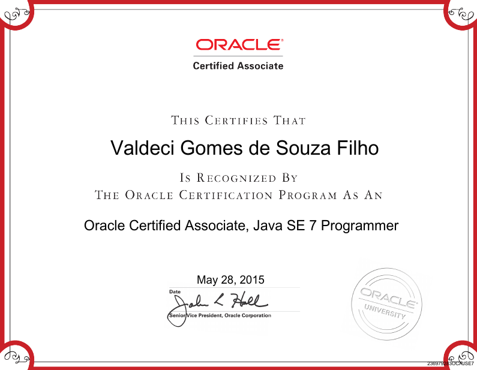
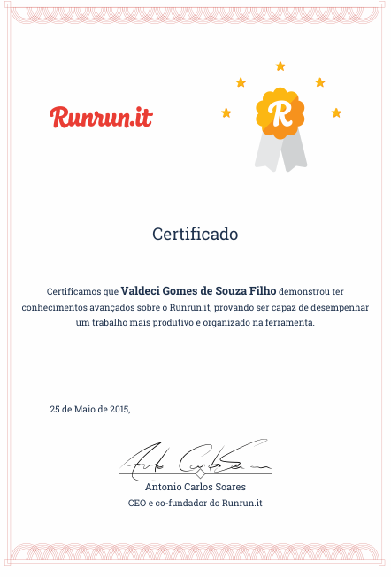

# Certificates
Repository that contain some of my certifications, courses and events certificates.
The certificates are sorted by the date that I got the certificates.

## Certifications

###  **May 2015**

#### - Oracle Certified Associate, Java SE 7 Programmer

A Java SE 7 Oracle Certified Associate (OCA) has built a foundational understanding of Java, while acquiring knowledge of general programming.

Certification URL: https://education.oracle.com/pls/web_prod-plq-dad/db_pages.getpage?page_id=5001&get_params=p_exam_id:1Z0-803

Language: EN-US

Claim: https://www.youracclaim.com/badges/683c766e-2b75-4d06-8d87-b638339efc37

#### - Expert User, RunRunIT
A universal test that validates if the user has advanced knowledge with the RunRun.it tool, testing the knowledge acquired at all levels of a RunRun.it user.

Certification URL: http://landing.runrun.it/certificacao-runrun-2/

Language: PT-BR

## Courses certificates

## Events certificates