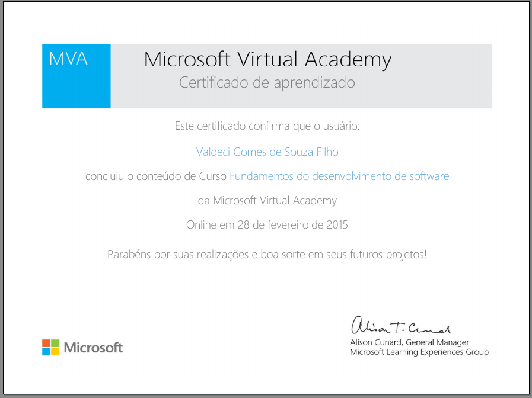

# Certificates
Repository that contain some of my certifications, courses and events certificates.
The certificates are sorted by the date that I got the certificates.

#####  Quick links
* [Certifications](#certifications)
* [Courses certificates](#courses-certificates)
* [Events certificates](#events-certificates) 

## Certifications

###  **May 2015**

#### - Oracle Certified Associate, Java SE 7 Programmer

A Java SE 7 Oracle Certified Associate (OCA) has built a foundational understanding of Java, while acquiring knowledge of general programming.

Certification URL: https://education.oracle.com/pls/web_prod-plq-dad/db_pages.getpage?page_id=5001&get_params=p_exam_id:1Z0-803

Applier: [Oracle University](http://education.oracle.com)

Language: EN-US

Claim: https://www.youracclaim.com/badges/683c766e-2b75-4d06-8d87-b638339efc37

#### - Expert User, RunRun.it
A universal test that validates if the user has advanced knowledge with the RunRun.it tool, testing the knowledge acquired at all levels of a RunRun.it user.

Certification URL: http://landing.runrun.it/certificacao-runrun-2/

Language: PT-BR

Applier: [RunRun.it](https://runrun.it/en-US)

## Courses certificates

###  February 2013

#### - Front-End Web Development Quick Start With HTML5, CSS, and JavaScript

For the beginner, starting to learn web development can be daunting. In this course, Shawn Wildermuth shows you step-by-step how to use client-side web development techniques to create immersive web sites.

Course URL: https://www.pluralsight.com/courses/front-end-web-app-html5-javascript-css

Language: EN-US

Applier: [Pluralsight](https://www.pluralsight.com/)

###  April 2013

#### - Introduction to PHP MVC with CakePHP

An introduction to building a PHP MVC website using the CakePHP Framework. The course includes installing and setting up your environment and walks you through the process of creating a functional web application.

Course URL: https://www.pluralsight.com/courses/introduction-php-mvc-cakephp

Language: EN-US

Applier: [Pluralsight](https://www.pluralsight.com/)

###  April 2014

#### - Windows 8.1 apps development with HTML5 and JavaScript

This series of videos presents the essential concepts involved in developing Windows 8.1 apps with HTML5 and JavaScript. The focus of the course is to explain the main functions and objects of the WinJS library, such as structuring code in namespaces and classes, declaration of WinJS controls and navigation, among others.

Course URL: https://mva.microsoft.com/pt-br/training-courses/desenvolvimento-de-apps-windows-81-com-html5-e-javascript-introduo-8843

Language: PT-BR

Applier: [Microsoft Virtual Academy](https://mva.microsoft.com/)

###  May 2014

#### - Storage Fundamentals 

Intel is at the forefront of providing technology that is being used to enable the deployment of scale-up and scale-out storage solutions. The Storage Fundamentals Program provides the foundation for understanding data storage,technology and architectures used in the Data Center and Cloud and an overview of Intel’s Technology and Vision for modernizing storage and evolving to a Software Defined Infrastructure.

Course URL: https://builders.intel.com/university/storagebuilders/coursescategory/storage-fundamentals

Language: PT-BR

Applier: [Intel® Builders](https://builders.intel.com/)

###  July 2014

#### - Programming Logic

For some time, the use of computers was limited to scientific projects and to some types of industrial connections.

The power of the computer, its features and capabilities were overlooked by the general public, who did not believe in the possible benefits of its use.

The situation has now reversed. Everyone knows of the importance of the computer in modern life. Even people who did not believe in the computer surrendered to the features and facilities that this technology brought to our daily lives.

In this course we will address the issue of deductive and mathematical thinking, its limits and abstract reasoning. We will start by reviewing some concepts, in order to consolidate their knowledge about how a computer works.

Course URL: http://www.ev.org.br/Cursos/Lists/Cursos/CursosOnline.aspx?List=98e0d3db-98a8-470b-add0-1ca8f9acf05c&ID=57

Language: PT-BR

Applier: [Escola Virtual Bradesco](http://www.ev.org.br/Paginas/Home.aspx)

#### - Portuguese - New Spelling Agreement

From the point of view of orthography, there are significant differences in the Portuguese language, and this does not only occur between Portugal and Brazil, but also in the other six countries where Portuguese is the official language: Cape Verde, Guinea Bissau, São Tomé and Prince, Angola, Mozambique and East Timor.

One of the main justifications for the creation of the New Orthographic Agreement is the end of the various spellings, giving greater visibility to our language, which is the seventh most spoken on the planet!

In a simple, objective and attention-grabbing way, the three characters of the course present the main changes in the Portuguese Language Spelling, as defined by the New Orthographic Agreement, in force since January 1, 2009.

Course URL: http://www.ev.org.br/Cursos/Lists/Cursos/CursosOnline.aspx?List=98e0d3db-98a8-470b-add0-1ca8f9acf05c&ID=49

Language: PT-BR

Applier: [Escola Virtual Bradesco](http://www.ev.org.br/Paginas/Home.aspx)

###  August 2014

#### - Portuguese - Written communication

In this course, you will learn grammar contents that are very important for the correct use of the Portuguese language, such as punctuation, chronology and spelling.

The course provides all the basic information necessary to compose a text with objectivity, clarity and conciseness. In addition, it is updated in relation to the New Spelling Agreement.

Course URL: http://www.ev.org.br/Cursos/Lists/Cursos/CursosOnline.aspx?List=98e0d3db-98a8-470b-add0-1ca8f9acf05c&ID=103

Language: PT-BR

Applier: [Escola Virtual Bradesco](http://www.ev.org.br/Paginas/Home.aspx)

#### - Written communication

In this course, you will learn grammar contents that are very important for the correct use of the Portuguese language, such as punctuation, chronology and spelling.

The course provides all the basic information necessary to compose a text with objectivity, clarity and conciseness. In addition, it is updated in relation to the New Spelling Agreement.

Course URL: http://www.ev.org.br/Cursos/Lists/Cursos/CursosOnline.aspx?List=98e0d3db-98a8-470b-add0-1ca8f9acf05c&ID=103

Language: PT-BR

Applier: [Escola Virtual Bradesco](http://www.ev.org.br/Paginas/Home.aspx)

###  October 2014

#### - PHP programming

Course to teach the most used language for Web development. Be within the main elements, techniques, commands and instructions in PHP.

Course content: Concepts, techniques, commands and instructions in PHP; Customer / server / TCP review; Reviewing / contextualizing computer programming: HTML and PHP.

Course URL: http://www.cursoslivresead.com.br/programacao-em-php/p

Language: PT-BR

Applier: [Cursos livres EAD](http://www.cursoslivresead.com.br/)

###  September 2014

#### - Software Development Fundamentals with .Net

In this course you will have an overview of how to develop applications in .NET (ASP.NET and Desktop), what is object-oriented programming, how to access database, use of web services, language control and error handling .

Course URL: https://mva.microsoft.com/pt-br/training-courses/fundamentos-do-desenvolvimento-de-software-8544

Language: PT-BR

###  November 2014

#### - Quick introduction to HTML5 development with JavaScript and CSS3

This course is subtitled in Portuguese. To activate the caption click the "CC" icon in the lower right corner of the video. This course is an accelerated introduction to HTML5, CSS3 and JavaScript and helps students acquire basic programming skills in HTML5 / CSS3 / JavaScript. It focuses on using HTML5 / CSS3 / JavaScript to implement programming logic, define and use variables, perform loops and branching, develop user interfaces, capture and validate user inputs, store data, and create well-structured applications. The course uses Visual Studio 2012, running on Windows 8, and is intended for developers who have at least six months of professional experience and are interested in developing applications using HTML5 with JavaScript and CSS3 (or Windows Store applications or applications IE10 for the Web). While it is possible for students to have little or no experience with HTML5 programming, it is desirable that they have some experience with HTML4. This is an intermediate to advanced student course that helps prepare for the 70-480 exam from Microsoft.

Course URL: https://mva.microsoft.com/pt-br/training-courses/introdu-o-r-pida-ao-desenvolvimento-em-html5-com-javascript-e-css3-8223

Language: PT-BR

Applier: [Microsoft Virtual Academy](https://mva.microsoft.com/)

###  December 2014

#### - HTML5 - With the W3C quality badge

With the W3C quality badge, this course targets all those who want to start working with HTML5 and get the main questions, as well as enhancing knowledge. This academy features a step-by-step format for introducing new HTML5 concepts. Here you can find what has changed to HTML5, use of new tags, how to work with videos, how to use the Geolocation API, work with storage and offline applications among many other subjects.

Course URL: https://mva.microsoft.com/pt-br/training-courses/html5-homologado-pelo-w3c-8551

Language: PT-BR

Applier: [Microsoft Virtual Academy](https://mva.microsoft.com/)

###  January 2015

#### - Jump Start on Building Web Apps with ASP.NET

This Jump Start is suitable for experienced application developers interested in leveraging ASP.NET and Visual Studio 2012 to offer modern applications that target modern browsers. Three of Microsoft's most experienced ASP.NET speakers provide an accelerated introduction on building web application development with ASP.NET 4.5 and ASP.NET MVC 4, targeting key scenarios such as building mobile-ready sites, Social web applications, and more.

Course URL: https://mva.microsoft.com/pt-br/training-courses/jump-start-sobre-constru-o-de-web-apps-com-asp-net-12646

Language: PT-BR

Applier: [Microsoft Virtual Academy](https://mva.microsoft.com/)

###  February 2015

#### - How to debug a Web site with the Internet Explorer F12 tools

If you want to know how to debug a site with the Internet Explorer F12 tools, check out this course! Experts show you how to use the tools to quickly find out why a website or a web page is not working correctly. Explore web standards and learn how to create a great website that can work seamlessly on any device and browser. Learn how to optimize your page, test it on multiple browsers and more, all created by experts!

Course URL: https://mva.microsoft.com/pt-br/training-courses/como-depurar-um-site-com-as-ferramentas-f12-do-internet-explorer-8658

Language: PT-BR

Applier: [Microsoft Virtual Academy](https://mva.microsoft.com/)

###  March 2015

#### - Java Mobile Applications (J2ME)

This course aims to impart knowledge in the development and use of wireless applications using J2ME.
In the first part of the course you will learn about J2ME architecture, its usage and environment. This material also introduces MIDlets and explains the various stages of developing a MIDlet.
The second part talks about programming with CLDC and MIDP, GUI in MIDlets, I / O management in MIDlets, MIDP networks, record management system and the future of J2ME.

Course URL: http://www.ev.org.br/Cursos/Lists/Cursos/CursosOnline.aspx?List=98e0d3db-98a8-470b-add0-1ca8f9acf05c&ID=102

Language: PT-BR

Applier: [Escola Virtual Bradesco](http://www.ev.org.br/Paginas/Home.aspx)

###  April 2015

#### - Maven Fundamentals

This course covers all of the basic fundamentals of Maven. It covers dependencies, plugins, repositories, IDE integrations, and all the basic commands of Maven.

Course URL: https://www.pluralsight.com/courses/maven-fundamentals

Language: EN-US

Applier: [Pluralsight](https://www.pluralsight.com/)

###  August 2015

#### - Angular Fundamentals

In this course, you will learn how simple it is to use Angular to create maintainable and testable single page applications. You will learn how to: bootstrap your Angular application; use AngularJS markup and expressions; create and use controllers; use built-in services and create custom services; turn your application into a SPA using routing; and create your own custom elements and handle events using directives. You will also learn how AngularJS allows you to do all thing using test-driven-development.

Course URL: https://www.pluralsight.com/courses/angularjs-fundamentals

Language: EN-US

Applier: [Pluralsight](https://www.pluralsight.com/)

###  April 2016

#### - Building Angular and Node.js Apps with the MEAN Stack

The MEAN stack is becoming more and more popular. Angular has become the hottest new MVC framework, and using it with Node and Express means a high level of harmony between the client and server. Throw MongoDB on for data storage, and you have JavaScript from front to back. These applications are quick to put together, and represent the modern state of web application development. This course will help you get a full application up and running in no time, and introduce you to all the core concepts you need to build applications utilizing these technologies.

Course URL: https://www.pluralsight.com/courses/angularjs-fundamentals

Language: EN-US

Applier: [Pluralsight](https://www.pluralsight.com/)

###  November 2016

#### - Building a Mobile App with AngularJS 1 and Ionic

Creating hybrid mobile applications is a great way to leverage your knowledge of web languages like HTML5, CSS, and JavaScript. Modern frameworks such as AngularJS and Ionic make it easier with pre-built templates and components. In this course, staff author Ray Villalobos shows how to install the Ionic framework and set up a development environment suitable for building web-based apps. He reviews the core Ionic components: prebuilt, easy-to-use features such as buttons, lists, tabs, and forms. Then Ray shows how to combine these components with Angular.js models, views, and controllers to build a single page app with sliders, pull-to-refresh functionality, and search. The training culminates in building a multi-page app, which you'll learn how to customize with CSS.

Course URL: https://www.lynda.com/AngularJS-tutorials/Building-Mobile-App-AngularJS-1-Ionic/368920-2.html

Language: EN-US

Applier: [Lynda](https://www.lynda.com)

###  February 2017

#### - Programming Foundations: Web Security

Learn about the most important security concerns when developing websites, and what you can do to keep your servers, software, and data safe from harm. Instructor Kevin Skoglund explains what motivates hackers and their most common methods of attacks, and then details the techniques and mindset needed to craft solutions for these web security challenges. Learn the eight fundamental principles that underlie all security efforts, the importance of filtering input and controlling output, and smart strategies for encryption and user authentication. Kevin also covers special considerations when it comes to credit cards, regular expressions, source code managers, and databases.

This course is great for developers who want to secure their client's websites, and for anyone else who wants to learn more about web security.

Topics include:
* Why security matters
* What is a hacker?
* How to write a security policy
* Cross-site scripting (XSS)
* Cross-site request forgery (CSRF)
* SQL injection
* Session hijacking and fixation
* Passwords and encryption
* Secure credit card payments

Course URL: https://www.lynda.com/Web-Development-tutorials/Foundations-Programming-Web-Security/133330-2.html

Language: EN-US

Applier: [Lynda](https://www.lynda.com)

###  November 2016

#### - SPECIALIZATION "Open Source + Azure for DevOps"

Want to support more agility in your dev, test, and deploy scenarios? Whether you're a Developer working in agile or an IT Pro in a growing enterprise, you know that modern software applications are heterogeneous, they include both Linux- and Windows-based components. At the same time, development processes continue to become more agile, and operations teams are responding in kind.

Watch how leading experts explore common open source tooling and show you what's possible, from a zero-process environment to a fully automated and deployed production environment. Get a working definition of DevOps, examine version control, and take a look at shareable environments and automated testing. Plus, get tips on what to explore next.

Course URL: https://www.microsoftevents.com/profile/form/index.cfm?PKformID=0x1573239480e

Language: ES-MX

Applier: [Microsoft Diplomados](http://www.microsoftdiplomados.com/)

## Events certificates

###  May 2014

#### - TECHDAY 2.0 

The CESAR, through its education unit, CESAR.EDU held the TECHDAY 2.0, the second edition of the event that promotes the dissemination of knowledge in the area of Information Technology and Communication. The event will consist of several online lectures, presented by CESAR employees with great professional experience. In all, there will be 6 lectures of 45 minutes each in the areas of development, project management, configuration management and information security.

Event URL: http://www.cesar.edu.br/techday-2-0/

Language: PT-BR

Applier: [Cesar.Edu](http://www.cesar.edu.br)